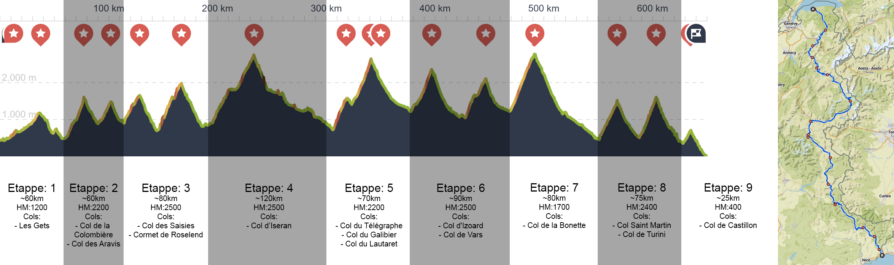

# Route Des Grandes Alpes
Vakantie 14-08-2023 <--> 01-09-2023

<table>
  <tr align="left">
    <th>Afstand</th>
    <td>650</td>
    <td>km</td>
  </tr>
  <tr align="left">
    <th>Stijging</th>
    <td>17840</td>
    <td>m</td>
  </tr>
  <tr align="left">
    <th>Daling</th>
    <td>2740</td>
    <td>m</td>
  </tr>
  <tr align="left">
    <th>Klimpunten</th>
    <td>10694</td>
    <td>-</td>
  </tr>
  <tr align="left">
    <th>Cols</th>
    <td>14</td>
    <td>-</td>
  </tr>
</table>

Etappes:
- [Etappe 1](Etappes/Etappe1.md)
- [Etappe 2](Etappes/Etappe2.md)
- [Etappe 3](Etappes/Etappe3.md)
- [Etappe 4](Etappes/Etappe4.md)
- [Etappe 5](Etappes/Etappe5.md)
- [Etappe 6](Etappes/Etappe6.md)
- [Etappe 7](Etappes/Etappe7.md)
- [Etappe 8](Etappes/Etappe8.md)
- [Etappe 9](Etappes/Etappe9.md)

<!-- 10u rijden naar autostalplaats, uur fietsen, half uur boot, eten meenemen
Boot van Lausanne-Ouchy naar Evian-les-Bains, 21+14=35 zwitserse frank: https://www.cgn.ch/en/trip/search/result/?direction=1&departure_date=2023-08-15&departure_hour=00%3A00&departure_station=LAUSA0&arrival_station=EVIAN0 -->